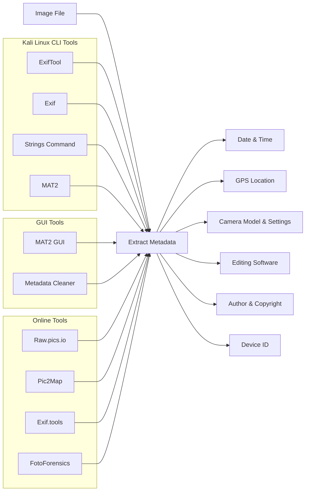

# Image Metadata Recon

**Definition:** Hidden data embedded in image files revealing when, where, how, and by whom the image was created or edited.
**Primary types:** EXIF, IPTC, XMP, File System.

---

## Common Data Stored

* Date and time taken
* GPS coordinates (latitude, longitude, altitude)
* Camera details (make, model, ISO, shutter, aperture)
* Software used for editing
* Author and copyright information
* Device identifiers

---

## Why It Matters

| Use Case            | Purpose                                      |
| ------------------- | -------------------------------------------- |
| Forensics and OSINT | Identify GPS, timestamps, device information |
| Privacy             | Prevent accidental location or data leaks    |
| Legal Proof         | Prove authorship and authenticity            |
| Digital Evidence    | Support cybercrime cases                     |

---

## Tooling

### CLI (Kali Linux)

| Tool     | Install                              | View Metadata                             | Remove Metadata           |     |
| -------- | ------------------------------------ | ----------------------------------------- | ------------------------- | --- |
| ExifTool | `apt install libimage-exiftool-perl` | `exiftool file.jpg`                       | `exiftool -all= file.jpg` |     |
| Exif     | `apt install exif`                   | `exif file.jpg`                           | N/A                       |     |
| Strings  | Built-in                             | \`strings file.jpg                        | less\`                    | N/A |
| MAT2     | `apt install mat2`                   | `mat2 file.jpg` / `mat2 --check file.jpg` | `mat2 --remove file.jpg`  |     |

---

### GUI Tools

* MAT2 GUI: `mat2 --gui`
* Metadata Cleaner (available in some desktop environments)

---

### Online Tools

| Tool          | Features                            |
| ------------- | ----------------------------------- |
| Raw\.pics.io  | EXIF, IPTC, XMP viewer, GPS mapping |
| Pic2Map       | GPS extraction and map plotting     |
| Exif.tools    | Quick EXIF view                     |
| FotoForensics | Metadata and error level analysis   |

---

## GPS Conversion (DMS to Decimal) - Python

```python
def dms_to_decimal(d, m, s):
    return d + (m/60) + (s/3600)

lat = dms_to_decimal(28, 36, 33.13)
lon = dms_to_decimal(77, 14, 34.01)
print(f"Google Maps: https://www.google.com/maps/search/?api=1&query={lat},{lon}")
```

---

## OSINT Workflow

1. Acquire image
2. Analyze metadata (ExifTool, MAT2, online viewers)
3. Extract GPS and convert to decimal
4. Map location
5. Identify camera or software clues
6. Sanitize before sharing

---

## Mermaid Diagram



---
\
